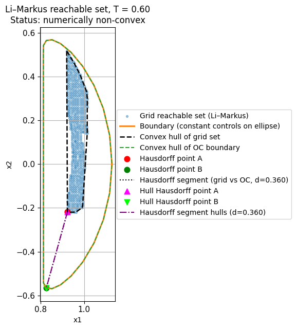
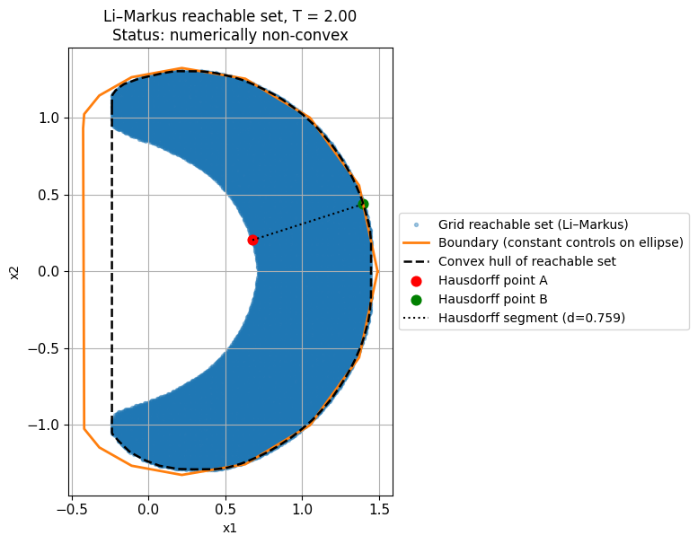
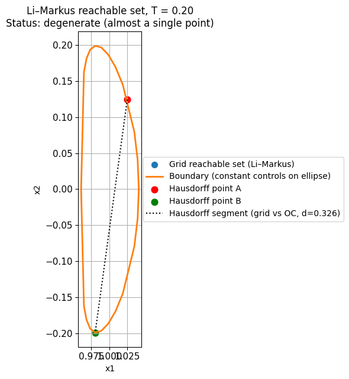
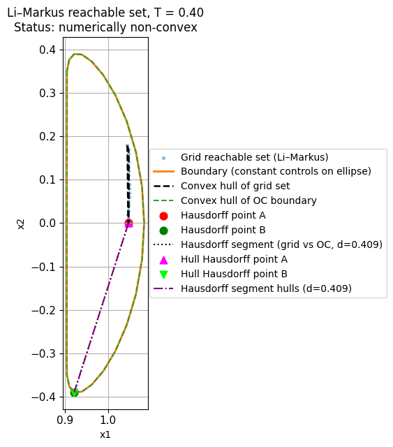
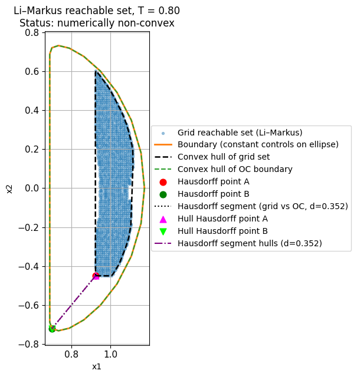
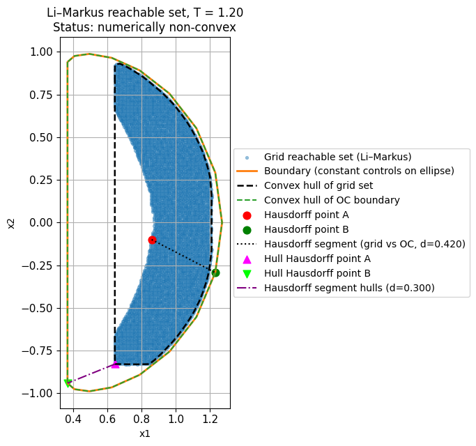
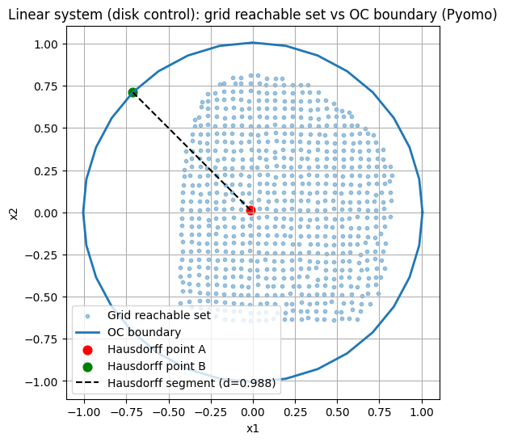
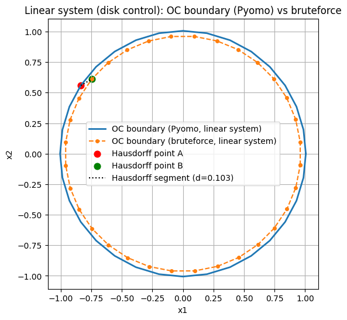

# Множества достижимости 2D управляемых систем (Сеточный метод vs Оптимальное управление, Ускорение с PyTorch)

Этот репозиторий содержит численные эксперименты с множествами достижимости двумерных управляемых систем.  
Основные цели:

1. Построить множество достижимости плоской управляемой системы **сеточным (облачным) методом** на Python.
2. **Ускорить** сеточный метод с помощью бэкенда PyTorch (CPU / GPU) и измерить прирост производительности.
3. Построить **границу** множества достижимости через **задачи оптимального управления в Pyomo**.
4. Построить обе аппроксимации множества достижимости на одном графике и вычислить **расстояние Хаусдорфа** между ними.
5. Изучить **невыпуклое множество достижимости** на классическом **примере Ли–Маркуса** и количественно оценить его отклонение от выпуклости через расстояние до его выпуклой оболочки.

Код структурирован так, чтобы его можно было запускать как локально, так и в Google Colab (с GPU).

---

## 1. Математические модели

### 1.1 Линейная система с дисковым управлением (выпуклое множество достижимости)

Это "базовая" система, используемая для большинства сравнений и границы Pyomo:

$$\dot x(t) = f(x(t), u(t)), \quad x(t) \in \mathbb{R}^2,\ u(t) \in P.$$

Динамика:

$$\begin{aligned}
\dot x_1 &= x_2 + u_1,\\
\dot x_2 &= -x_1 + u_2,
\end{aligned}$$

с множеством управлений

$$P = \{u \in \mathbb{R}^2 : \lVert u \rVert_2 \le u_{\max}\}.$$

Начальное условие:

$$x(0) = x_0.$$

Множество достижимости в момент времени $T$:

$$\mathcal{R}(T)
  = \{x(T) : x(0) = x_0,\ \dot x = f(x,u),\ u(\cdot) \in \mathcal{U}\}.$$

Поскольку система линейна и множество управлений выпукло, $\mathcal{R}(T)$ выпукло для любого $T > 0$.

### 1.2 Пример Ли–Маркуса (нелинейный по управлению, невыпуклое множество достижимости)

Вторая модель — классический пример Ли–Маркуса, используемый здесь для демонстрации невыпуклых множеств достижимости:

$$\begin{aligned}
\dot x_1 &= x_2 u_1 - x_1 u_2,\\
\dot x_2 &= -x_1 u_1 - x_2 u_2,
\end{aligned}$$

с эллиптическим множеством управлений

$$u_1^2 + 25 u_2^2 \le 1,$$

и начальным условием

$$x(0) = (1, 0).$$

Для этой системы множество достижимости на фиксированном временном интервале, как правило, **невыпукло**.  
В проекте невыпуклость визуализируется и количественно оценивается через расстояние Хаусдорфа между множеством достижимости и его выпуклой оболочкой.

---

## 2. Реализованные методы

### 2.1 Сеточное (облачное) множество достижимости

Время дискретизируется на $N$ шагов:

$$0 = t_0 < t_1 < \dots < t_N = T,\quad \Delta t = T/N.$$

Множество управлений $P$ аппроксимируется конечным подмножеством
$\{u^k\}_{k=1}^M \subset P$ (точки на окружности или эллипсе).

На каждом временном шаге $i$:

1. Текущее облако точек — $W_i$.
2. Для каждого $x \in W_i$ и каждого дискретного управления $u^k$ применяется один шаг явной схемы Эйлера:
   $$x^{\text{new}} = x + \Delta t\, f(x, u^k).$$
3. Все новые точки собираются во временное облако $\widetilde{W}\_{i+1}$.
4. К $\widetilde{W}\_{i+1}$ применяется процедура **прореживания**, создающая уменьшенное облако $W\_{i+1}$.

После $N$ шагов $W\_N$ принимается за численную аппроксимацию $\mathcal{R}(T)$.

Реализованы две стратегии прореживания:

- **Сеточное прореживание** — прямоугольная сетка с шагом $h$; не более одного представителя на ячейку сетки.
- **Прореживание диском Пуассона** — жадный алгоритм, обеспечивающий минимальное попарное расстояние $r$ между сохраненными точками.

Базовая реализация использует **NumPy** на CPU.  
Ускоренный бэкенд использует **PyTorch** и может выполнять как распространение, так и сеточное прореживание на GPU.

### 2.2 Метод Pyomo через направления на окружности / эллипсе

Для линейной системы граница множества достижимости строится в Pyomo путем решения семейства задач оптимального управления вдоль различных направлений.

Для каждого угла направления $\varphi$ определим

$$\ell(\varphi) = (\cos\varphi,\ \sin\varphi).$$

Задача оптимизации:

$$\max_{u(\cdot)}\ \langle \ell(\varphi), x(T) \rangle$$

при условиях

- динамика $\dot x = f(x,u)$,
- ограничение на управление $\lVert u(t)\rVert_2 \le u_{\max}$,
- начальное условие $x(0) = x_0$.

Задача дискретизируется на той же временной сетке, что и сеточный метод:

- переменные решения: $x_k \in \mathbb{R}^2$, $u_k \in \mathbb{R}^2$ для $k = 0,\dots,N-1$;
- динамика:
  $$x_{k+1} = x_k + \Delta t\, f(x_k, u_k).$$

Для каждого $\varphi$ получается одна оптимальная конечная точка $x_\varphi(T)$; множество $\{x_\varphi(T)\}$ по равномерной сетке углов аппроксимирует границу множества достижимости.  
Это в точности **метод 1** из описания руководителя: "через окружность/эллипс и цикл задач оптимального управления с линейными функционалами".

Для примера Ли–Маркуса этот метод аппроксимировал бы **выпуклую оболочку** множества достижимости (впадины/невыпуклые части не видны опорным функционалам), поэтому невыпуклость анализируется с использованием сеточного метода.

Также реализован более простой вариант без Pyomo: "перебор постоянных управлений". Для каждого направления $\varphi$ перебирается конечное множество постоянных управлений $u(t)\equiv u$ на окружности/эллипсе; выбирается лучшая конечная точка в направлении $\ell(\varphi)$.

### 2.3 Расстояние Хаусдорфа и анализ выпуклости

Для двух конечных облаков точек $A, B \subset \mathbb{R}^2$ симметричное расстояние Хаусдорфа:

$$d_H(A,B)
= \max\left\\{
\max_{a\in A}\min_{b\in B}\lVert a-b\rVert_2,\,
\max_{b\in B}\min_{a\in A}\lVert b-a\rVert_2
\right\\}.$$

Код вычисляет:

- расстояние Хаусдорфа между сеточным множеством достижимости и границей Pyomo;
- для примера Ли–Маркуса: расстояние Хаусдорфа между сеточным множеством достижимости и его **выпуклой оболочкой** (через `scipy.spatial.ConvexHull`).

Расстояние до выпуклой оболочки используется как **численная мера невыпуклости**; качественный статус ("численно невыпукло" vs "приблизительно выпукло") выводится для каждого временного горизонта $T$.

---

## 3. Структура проекта и назначение файлов

Все файлы находятся в корне проекта.

### 3.1 Основная динамика и управления

- **`system.py`**

  - `ControlledSystem`  
    Линейная система с дисковым управлением, предоставляет `f_numpy(x, u)`, используемую в сеточном методе.
  - `ControlledSystemTorch`  
    Та же динамика, реализованная в PyTorch, предоставляет `f_torch(X, U)` для пакетного распространения на CPU/GPU.

- **`controls.py`**

  - `generate_controls_disk(num_controls, u_max, on_circle)`  
    Дискретные управления, равномерно распределенные по окружности (границе управляющего диска) или внутри диска.
  - `generate_controls_box(...)`, `generate_controls_ellipse(...)`  
    Вспомогательные функции для прямоугольных и эллиптических множеств управлений (не все варианты используются в финальном эксперименте, но могут быть переиспользованы).

### 3.2 Прореживание и бэкенды

- **`thinning.py`**

  - `thin_grid(points, h)`  
    NumPy-реализация сеточного прореживания: не более одной точки на ячейку сетки размера $h$.
  - `thin_poisson(points, r)`  
    Простое прореживание в стиле диска Пуассона: жадный выбор точек на расстоянии не менее $r$ друг от друга.

- **`backend_numpy.py`**

  - `propagate_numpy(system, states, controls, dt)`  
    Векторизованный шаг явного Эйлера для сеточного метода. По облаку состояний и конечному множеству управлений возвращает объединенное облако всех преемников.

- **`backend_torch.py`**

  - `propagate_torch_tensor(system, states_t, controls_t, dt)`  
    Torch-версия шага распространения на тензорах устройства.
  - `thin_grid_torch(points_t, h)`  
    Сеточное прореживание, полностью реализованное в Torch (без переходов на CPU), подходит для ускорения на GPU.
  - `propagate_torch_numpy(...)`  
    Обратно совместимая обертка, принимающая NumPy-массивы и внутренне использующая Torch.

### 3.3 Высокоуровневый сеточный метод

- **`grid_reachability.py`**

  - `ReachabilityConfig`  
    Датакласс конфигурации:
    - конечное время `T`,
    - число временных шагов `num_time_steps`,
    - бэкенд (`"numpy"` или `"torch"`),
    - метод прореживания (`"grid"` или `"poisson"`),
    - параметр прореживания (`h` или `r`),
    - опциональное `torch_device` (`"cpu"` или `"cuda"`).
  - `compute_reachable_set_grid(system, x0, controls, cfg)`  
    Основная функция сеточного метода:
    - итерируется по временным шагам,
    - вызывает выбранный бэкенд,
    - применяет прореживание на каждом шаге,
    - возвращает финальное облако точек в момент времени $T$.

### 3.4 Оптимальное управление Pyomo

- **`ocp_pyomo.py`**

  - `solve_ocp_direction(phi, system, x0, T, num_time_steps, solver_name)`  
    Строит и решает одну задачу оптимального управления в направлении $\ell(\varphi)$ для линейной системы.
  - `compute_oc_boundary(system, x0, T, num_time_steps, num_directions, solver_name)`  
    Выполняет цикл по направлениям и собирает оптимальные конечные точки во множество граничных точек.
  - `compute_oc_boundary_bruteforce(system, x0, T, num_time_steps, phis, control_candidates)`  
    Строит приближенную границу путем перебора постоянных управлений на окружности/эллипсе. Используется как для линейной системы, так и для примера Ли–Маркуса.

Для системы Ли–Маркуса небольшой класс `LiMarkusSystem` с `f_numpy` определяется непосредственно в `experiment.py`, поскольку используется только в этом примере.

### 3.5 Расстояние Хаусдорфа и построение графиков

- **`hausdorff.py`**

  - `HausdorffResult`  
    Датакласс, хранящий:
    - `distance` — расстояние Хаусдорфа,
    - `point_a`, `point_b` — пара точек, где достигается (приблизительно) расстояние.
  - `hausdorff_distance(A, B)`  
    Вычисляет симметричное расстояние Хаусдорфа между конечными облаками точек `A` и `B` (NumPy-массивы формы `(N, 2)` и `(M, 2)`).

- **`plotting.py`**

  - `plot_reachable_sets(R_grid, R_oc, hd, title, save_path)`  
    Строит графики:
    - сеточное множество достижимости `R_grid`,
    - граница `R_oc`,
    - и отрезок Хаусдорфа между `hd.point_a` и `hd.point_b`.  
    Используется в эксперименте с линейной системой.

### 3.6 Основные эксперименты и бенчмарки

- **`experiment.py`**

  Содержит высокоуровневую оркестрацию и все графики:

  - `run_linear_example()`  
    Линейная система с дисковым управлением:
    - сеточное множество достижимости (NumPy, сеточное прореживание),
    - прореживание Пуассона (для сравнения плотностей),
    - сеточное множество достижимости (Torch, сеточное прореживание) с измерением времени и ускорения,
    - граница Pyomo через оптимальное управление в направлениях $\ell(\varphi)$,
    - граница через перебор постоянных управлений,
    - расстояние Хаусдорфа:
      - между сеточным множеством и границей Pyomo,
      - между границами Pyomo и перебора,
    - визуализация на двух графиках.

  - `run_li_markus_example()`  
    Пример Ли–Маркуса:
    - для нескольких временных горизонтов $T$ строит сеточное множество достижимости (бэкенд NumPy),
    - строит приближенную границу через перебор постоянных управлений на эллиптическом множестве управлений,
    - вычисляет выпуклую оболочку множества достижимости и расстояние Хаусдорфа до нее,
    - выводит качественный статус выпуклости ("вырожденное", "численно невыпукло", "приблизительно выпукло"),
    - рисует графики с:
      - сеточным множеством достижимости,
      - границей,
      - выпуклой оболочкой,
      - отрезком Хаусдорфа.

  - `benchmark_reachability_speed()`  
    Сравнивает время выполнения сеточного метода для NumPy vs Torch (CUDA) на линейной системе для нескольких комбинаций:
    - `num_controls`,
    - `num_time_steps`.  
    Выводит время выполнения, размеры облаков и измеренное ускорение.

  - `run_experiment()`  
    Вспомогательная функция, последовательно запускающая `run_linear_example()` и `run_li_markus_example()`.

---

## 4. Установка

### 4.1 Требования

Python 3.10+ и следующие пакеты:

- `numpy`
- `matplotlib`
- `pyomo`
- `torch`
- `scipy`

Установка через:

```bash
pip install numpy matplotlib pyomo torch scipy
```

Для задач оптимального управления Pyomo требуется нелинейный решатель, например **IPOPT**.
В Google Colab предсобранные бинарные файлы IPOPT можно скачать и добавить в `PATH`; пример ноутбука обычно использует команды вроде:

```bash
!pip install -q pyomo
# скачать и распаковать ipopt, затем убедиться, что бинарный файл в PATH
```

Адаптируйте эту часть под вашу среду.

### 4.2 Локальный запуск

Клонируйте репозиторий:

```bash
git clone https://github.com/zv3zdochka/reachable-sets-2d-pyomo-grid-torch.git
```

Установите зависимости (опционально добавьте `requirements.txt`):

```bash
pip install -r requirements.txt
# или установите перечисленные выше пакеты вручную
```

Убедитесь, что NLP-решатель (например, `ipopt`) доступен для Pyomo.

Запустите:

```bash
python experiment.py
```

Скрипт:

1. Запустит **эксперимент с линейной системой**, выведет время выполнения и расстояния Хаусдорфа и покажет два графика (сетка vs Pyomo, Pyomo vs перебор).
2. Запустит **эксперимент Ли–Маркуса**, выведет размер множества достижимости, статус выпуклости и отобразит серию графиков для различных $T$.

### 4.3 Запуск в Google Colab

Типичный рабочий процесс Colab:

1. Загрузите все файлы `*.py` в рабочий каталог или распакуйте архив проекта.

2. Включите GPU (Runtime → Change runtime type → GPU).

3. Установите зависимости:

   ```python
   !pip install numpy matplotlib pyomo torch scipy
   # плюс установка IPOPT или другого решателя
   ```

4. Импортируйте и запустите:

   ```python
   from experiment import run_experiment
   run_experiment()
   ```

Для запуска бенчмарка скорости:

```python
from experiment import benchmark_reachability_speed
benchmark_reachability_speed()
```

---

## 5. Назначение и ожидаемые результаты

Репозиторий предназначен для компактной, но полной реализации задания:

* показать **два различных способа построения** множеств достижимости (сеточный метод vs оптимальное управление через Pyomo),
* продемонстрировать, как **GPU-бэкенд** (PyTorch) может значительно ускорить сеточный метод для больших конфигураций,
* проиллюстрировать **разницу между выпуклыми и невыпуклыми множествами достижимости**:

  * выпуклый случай: линейная система с дисковым управлением, где методы Pyomo и сеточный согласуются;
  * невыпуклый случай: пример Ли–Маркуса, где сеточный метод и выпуклая оболочка заметно различаются,
* количественно оценить расхождение между различными аппроксимациями через **расстояние Хаусдорфа** и визуализировать его непосредственно на графиках.

Эта структура может быть переиспользована для других плоских управляемых систем путем замены динамики и генераторов множеств управлений.

---

## 6. Примеры результатов

### 6.1 Невыпуклое множество достижимости Ли–Маркуса при T = 0.60



На раннем временном горизонте $T = 0.60$ система Ли–Маркуса демонстрирует **явно невыпуклое множество достижимости**. На графике показано:

- **Сеточное множество достижимости** (синие точки) — вычисленное сеточным методом с бэкендом NumPy
- **Граница** (оранжевая кривая) — построенная с использованием постоянных управлений на эллиптическом множестве управлений
- **Выпуклая оболочка** (черная пунктирная линия) — выпуклая оболочка множества достижимости
- **Отрезок Хаусдорфа** (пунктирная линия) — соединяет две точки, реализующие расстояние Хаусдорфа между множеством достижимости и его выпуклой оболочкой

Расстояние Хаусдорфа **0.175** количественно оценивает отклонение от выпуклости. Множество достижимости имеет характерную узкую форму "пальца", демонстрируя, что нелинейность системы по управлению порождает геометрические структуры, которые не могут быть представлены только выпуклыми комбинациями.

### 6.2 Множество достижимости Ли–Маркуса при T = 2.00



На более длинном временном горизонте $T = 2.00$ множество достижимости значительно вырастает и сохраняет свой **невыпуклый характер**, теперь с более сложной формой полумесяца или "луны". Ключевые наблюдения:

- Множество достижимости (синяя область) имеет большую внутреннюю область, которая **не достижима**, создавая выраженную невыпуклую полость
- **Выпуклая оболочка** (черная пунктирная граница) значительно переоценивает фактическое множество достижимости
- Расстояние Хаусдорфа увеличивается до **0.759**, что указывает на более сильную невыпуклость с эволюцией времени
- Граница (оранжевая) точно следует краю сеточного множества, подтверждая оба метода

Этот пример иллюстрирует, почему методы оптимального управления, основанные на опорных функциях (которые восстанавливают только выпуклую оболочку), недостаточны для анализа невыпуклой достижимости, и подчеркивает необходимость сеточных методов или методов множеств уровня для таких систем.


### 6.3 Другие примеры








